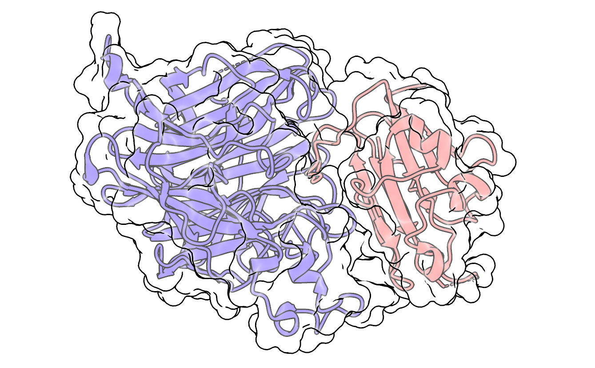
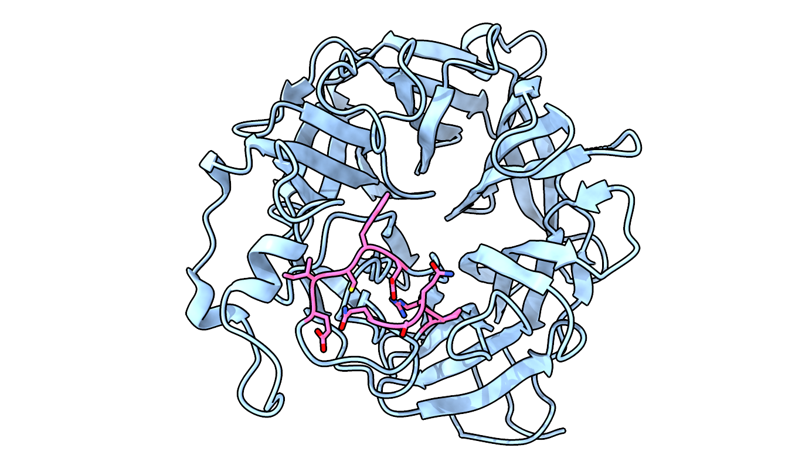
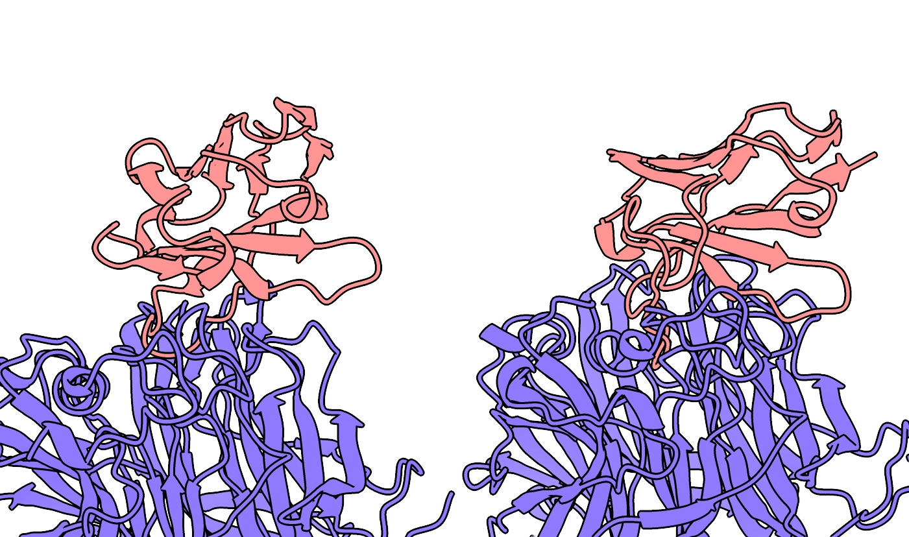
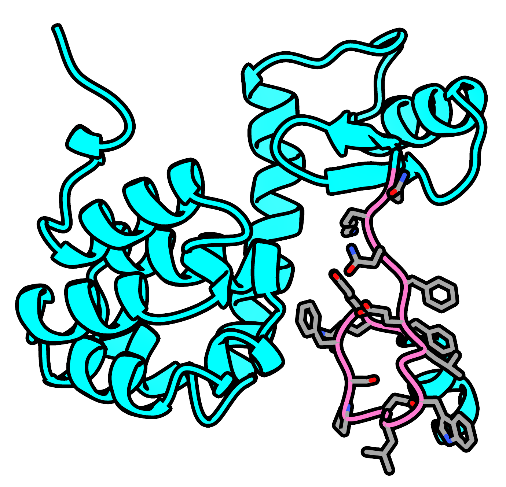
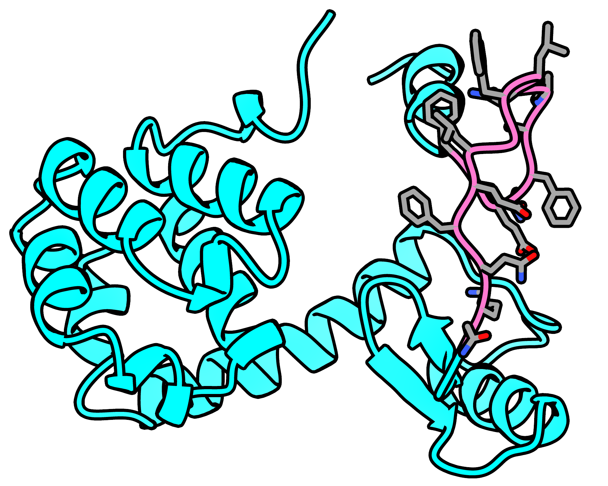
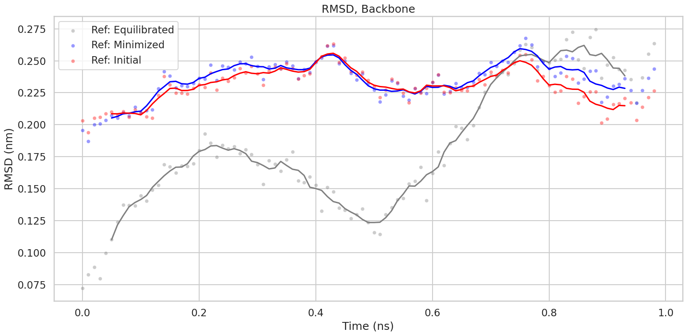
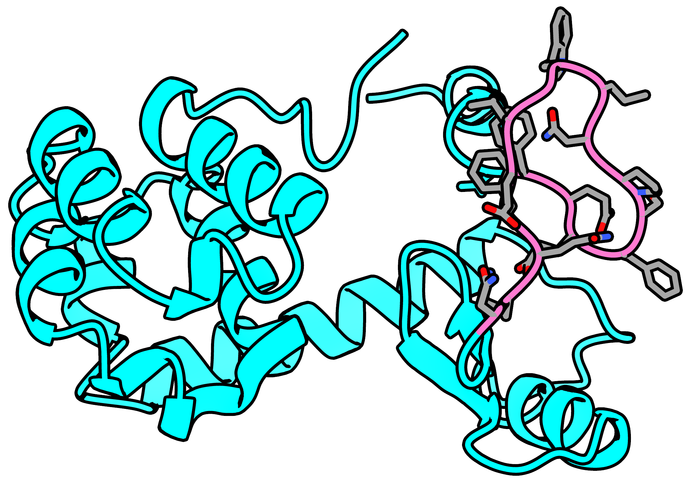
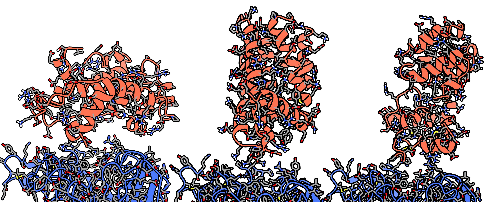

# My binders for the Nipah Binder Competition

[Nipah Binder Competition](https://proteinbase.com/competitions/adaptyv-nipah-competition)

I am improvising as I go, I won't read any blogs on binder design, I won't research that much, I just want to play around with any tool I might find interesting and just use it. I won't dedicate a lot of time on the project.

## Structure

First I looked at the structure to get a general feel.

<figure>
    
    <figcaption align = "center">Nipah virus attachment glycoprotein (NiV-G) in complex with human cell surface receptor ephrin B2 (EFNB2). NiV-G in blue, EFNB2 in red. A clear cavity can be seen which should be the target of this binder.</figcaption>
</figure>

## Strategy

I will decide as I go, I plan to use any interesting tool I find just to get to know how to use it.

## Small prep

I select the chain A and remove waters, heteroatoms using [pdb-tools](https://www.bonvinlab.org/pdb-tools/).

```bash
pdb_selchain -A 2VSM.pdb | pdb_delhetatm > 2VSM_chainA.pdb
```

## BoltzGen through Tamarind Bio

BoltzGen from [Tamarind Bio&#39;s server](https://app.tamarind.bio/tools/boltzgen) is an easy-to-use server (only 10 jobs per month on their free plan so I will use it only once).

I used the following settings:

- Nanobody mode
- Length: 50-150 amino acids
- Binding site: 487-492, 501-505
- Distance from binding site: 10 Angstrom
- N. of designs: 10
- Everythin else: default

<figure>
    
    <figcaption align = "center">The amino acids I set as the binding site, colored in pink.</figcaption>
</figure>

Based on the generated [pdf report](tamarind_bio-boltzgen/result-2vsm_nanob/final_ranked_designs/results_overview.pdf) only one design passed all filters which is not necessarily bad since these filters are extremely strict; so I don't have to discard them all. Normally the top 2 binders are the designs maximize score and minimize similarity, but in this case the default is to focus only on quality over diversity.

<figure>
    
    <figcaption align = "center">Top 2 binders. NiV-G in blue, binders in red.</figcaption>
</figure>

## proteindj

[proteindj](https://github.com/PapenfussLab/proteindj) is a pipeline fro protein design that uses external software like:

- AlphaFold2 Initial Guess (from https://github.com/nrbennet/dl_binder_design)
- BioPython (from https://biopython.org/)
- Boltz-2 (from https://github.com/jwohlwend/boltz)
- Full-Atom MPNN (from https://github.com/richardshuai/fampnn)
- ProteinMPNN-FastRelax (from https://github.com/nrbennet/dl_binder_design)
- RFdiffusion (from https://github.com/RosettaCommons/RFdiffusion)
- PyRosetta (from https://www.pyrosetta.org/)

proteindj's BindSweeper module enables sweeping of different parameters for binder design.

Command to run the nextflow pipeline:

The flag `--rfd_input_pdb` specifies the target protein and `-profile` specifies the mode, a denovo binder in this case. This command specifies that RFDiffusion should make a binder for chain A (the target protein) on the 450 to 550 positions of around 40 to 50 amino acids (chain B, the binder), by the `--rfd_contigs` flag. The specific binding site residues are specified by the `--rfd_hotspots` flag. The `custom.config` is modifying some memory requirements so that proteindj can run on my machine (thank you mr Claude).

run `00`

```bash
nextflow run ~/Downloads/gits/proteindj/ \
    -profile binder_denovo,apptainer \
    -c ../custom.conf \
    --rfd_input_pdb ../../data/2VSM_chainA.pdb \
    --rfd_contigs "[A450-550/0 40-50]" \
    --rfd_hotspots "[A488,A489,A490,A491,A492,A501,A502,A503,A504,A505]"
```

run `01`

```bash
nextflow run ~/Downloads/gits/proteindj/ \
    -profile binder_denovo,apptainer \
    -c ../custom.conf \
    --rfd_input_pdb ../../data/2VSM_chainA.pdb \
    --rfd_contigs '[A211-245/A550-589/0 60-80]' \
    --rfd_hotspots '[A211,A212,A213,A214,A215,A236,A237,A238,A239,A240,A241,A242,A243,A553,A554,A555,A556,A557,A581,A582,A583,A584,A585,A586,A587,A588,A589]'
```

run `02`

```bash
nextflow run ~/Downloads/gits/proteindj/ \
    -profile binder_denovo,apptainer \
    -c ../custom.conf \
    --rfd_input_pdb ../../data/2VSM_chainA.pdb \
    --rfd_contigs '[A374-401/0 60-80]' \
    --rfd_hotspots '[A374,A375,A376,A377,A378,A379,A380,A381,A382,A383,A384,A385,A386,A387,A388,A389,A390,A391,A392,A393,A394,A395,A396,A397,A398,A399,A400,A401]'
```

run `03`

```bash
nextflow run ~/Downloads/gits/proteindj/ \
    -profile binder_denovo,apptainer \
    -c ../custom.conf \
    --rfd_input_pdb ../../data/2VSM_chainA.pdb \
    --rfd_contigs '[A374-401/0 60-80]' \
    --rfd_hotspots '[A374,A375,A376,A377,A378,A379,A380,A381,A382,A383,A384,A385,A386,A387,A388,A389,A390,A391,A392,A393,A394,A395,A396,A397,A398,A399,A400,A401]' \
    --rfd_noise 1.5
```

run `04`

```bash
nextflow run ~/Downloads/gits/proteindj/ \
    -profile binder_denovo,apptainer \
    -c ../custom.conf \
    --rfd_input_pdb ../../data/2VSM_chainA.pdb \
    --rfd_contigs '[A211-245/A550-589/0 120-150]' \
    --rfd_hotspots '[A211,A212,A213,A214,A215,A236,A237,A238,A239,A240,A241,A242,A243,A553,A554,A555,A556,A557,A581,A582,A583,A584,A585,A586,A587,A588,A589]' \
    --rfd_noise 1.5
```

run `05`

```bash
nextflow run ~/Downloads/gits/proteindj/ \
    -profile binder_denovo,apptainer \
    -c ../custom.conf \
    --rfd_input_pdb ../../data/2VSM_chainA.pdb \
    --rfd_contigs "[A450-550/0 120-150]" \
    --rfd_hotspots "[A488,A489,A490,A491,A492,A501,A502,A503,A504,A505]" \
    --rfd_noise 1.75
```

Couldn't optimize the params perfectly, don't have time to play around with it more.

Best runs (highest binder pLDDT):

| Run          | name                     | af2_plddt_binder |
| ------------ | ------------------------ | ---------------- |
| __00__ | `fold_2_seq_3_af2pred` | $95.80$        |
| __01__ | `fold_1_seq_1_af2pred` | $94.44$        |
| __02__ | `fold_6_seq_7_af2pred` | $90.89$        |
| __03__ | `fold_4_seq_2_af2pred` | $91.16$        |
| __04__ | `fold_2_seq_1_af2pred` | $96.48$        |
| __05__ | `fold_2_seq_1_af2pred` | $92.59$        |

Not even one of them had correct orientation (since I was using a fragment of NiV-G, the binder was orienting itself in a position that was unnatural when the whole protein is considered.

## rational

This is more of a hands on approach. I will use lysozyme as my base and replace its active site with the loop of the EFNB2 receptor that binds to NiV-G. I will create 50 chimeric molecules with [MODELLER](https://salilab.org/modeller/) (using this [script](rational/models/modeller_exe.py)), then I will select the most stable one using [FoldX](https://foldxsuite.crg.eu/) (using this [script](rational/run_foldx.sh)).

<figure>
    
    <figcaption align = "center">Most stable (based on FoldX) structure of the 50 generated chimeras from MODELLER, model 25. Lysozyme regions in cyan, binder region in hot pink.</figcaption>
</figure>

I think the N-terminal alpha helix is extremely off-center and exposed so I will manually rotate it to make it more compact (with PyMOL).

<figure>
    
    <figcaption align = "center">N-terminal alpha-helix manually rotated so as its better oriented close to the main body of the protein.</figcaption>
</figure>

Then, using [OpenMM](https://openmm.org/) I ran a really short MD simulation (Langevin dynamics, NVT and NPT equilibration) to stabilize the sytem and extract the most stable confomation; I used this [script](openmm_MnE/mm.py) on both of the above protein conformations.

___MD Params:___

| Parameter            | Value               |
| -------------------- | ------------------- |
| Force fields         | $Amber14$         |
| Padding              | $1.5 \quad nm$    |
| Ionic Strength       | $0.1 \quad M$     |
| Temperature          | $300 \quad K$     |
| Friction coefficient | $1 \quad p^{-1}$  |
| Time setp            | $2 \quad fs $     |
| Time in NVT          | $ 100 \quad ps $  |
| Time in NPT          | $ 100 \quad ps $  |
| Barostat timestep    | $ 0.05 \quad ps $ |
| Production time      | $ 1 \quad ns $    |

Based on the analysis in [this notebook](openmm_MnE/analysis.ipynb), I select a single structure for the manually modified protein, from frame 75 (also see figure below).

<figure>
    
    <figcaption align = "center">RMSD of the binder whose N-terminal was manually rotated. There are 3 RMDS calculations shown, gray corresponds to the equilibrated structure (after the 100 NVT and 100 NPT ps of equilibration), blue to the minimized structure, and red to the initial structure. At around frame 75, all 3 RMSDs seem to level off.</figcaption>
</figure>

<figure>
    
    <figcaption align = "center">Frame 75, most stable conformation.</figcaption>
</figure>

The FoldX calculations indicate steric clashes (even after the relaxation), which makes sense since this is a structure that I manually modified by hand. I will run it through [ColabFold](https://colab.research.google.com/github/sokrypton/ColabDesign/blob/main/rf/examples/diffusion.ipynb) to add noise with Partial Diffusion, modify the residues with ProteinMPNN and maybe get a wider range of binders that are also more usable.

___ColabFold Params:___

- __RFDiffusion settings__| run         | 1  | 2   | 3  |
  | ----------- | -- | --- | -- |
  | num_designs | 8  | 16  | 16 |
  | iterations  | 50 | 100 | 25 |
- __symmetry settings__| run           | 1    | 2    | 3    |
  | ------------- | ---- | ---- | ---- |
  | symmetry      | auto | auto | auto |
  | order         | 1    | 1    | 1    |
  | add_potential | yes  | yes  | yes  |
- __advanced settings__| run            | 1   | 2   | 3   |
  | -------------- | --- | --- | --- |
  | partial_T      | 10  | 40  | 10  |
  | use_beta_model | yes | yes | yes |
- __advanced settings__| run            | 1   | 2   | 3   |
  | -------------- | --- | --- | --- |
  | partial_T      | 10  | 40  | 10  |
  | use_beta_model | yes | yes | yes |
- __ProteinMPNN settings__| run                | 1    | 2    | 3    |
  | ------------------ | ---- | ---- | ---- |
  | num_seqs           | 8    | 16   | 4    |
  | mpnn_sampling_temp | 0.15 | 0.25 | 0.25 |
  | use_solubleMPNN    | yes  | yes  | yes  |
  | rm_aa              | C    | C    |      |
- __AlphaFold settings__| run           | 1   | 2   | 3   |
  | ------------- | --- | --- | --- |
  | initial_guess | yes | yes | yes |
  | num_recycles  | 1   | 3   | 3   |
  | use_multimer  | no  | yes | yes |

I am keeping the top model from each run and I will run a MD run to stabilize them, with the same parameters as above (this [script](rational/best_diffused/mm.py)). After the runs end, I select the frames that seem to be the best equilibrated:

- frame 80 for run 1 ([best_r1_final.pdb](rational/best_diffused/best_r1_final.pdb))
- frame 40 for run 2 ([best_r2_final.pdb](rational/best_diffused/best_r2_final.pdb))
- frame 60 for run 3 ([best_r3_final.pdb](rational/best_diffused/best_r3_final.pdb))

Then I would normally run a docking simulation with the peptide that should sit in the pocket of NiV-G before running another simulation; but since I don't have time, I will simply eyball it.

<figure>
    
    <figcaption align = "center">Binders from frames 80, 40, and 60 for runs 1, 2, and 3 respectively, in red. NiV-G in blue.</figcaption>
</figure>

Seems good enough. No time to do more.

__CLUSTALW 2.1 of my final seqs__

- __rb1:__ rational design binder 1
- __rb2:__ rational design binder 2
- __rb3:__ rational design binder 3
- __bg1:__ BoltzGen design 1
- __bg2:__ BoltzGen design 2

```
rb1             VSQEELEKQLAPLGEYSKDGKDNRGKEQPYLWLGVPLSKSKDKEAVRAEASKRVGVEVGD
rb3             MSKEELDRLRCPWDSPCPDGKDCRSEEAHELAPGVRLSDSTDRSEALKVASELLGRKVGD
rb2             -SEEEWELLKLALEHLVEKTERTLEEILKEIKFGEPLSPEVEKLLEELRKKAEEHLERLK
bg1             --------------------------------------------EVQLVESGGGLVQAGG
bg2             --------------------------------------------GPQLTQSPSSLSASAG
                                                                  .     

rb1             ELSLEQILALVAAARAEVRARLEADPRLAPAMAALPASLRPAVEVLALLLGVEALAADAA
rb3             TLSHEDIERIRNQRFSEAERALRAEPRLRPVLEQCSPAQRQALITLALLLGLERVLALAP
rb2             KLLEKGPKYRWEALEELIEYIRLQLKYAVVEYLANEGPKSKIDEVVSLFEKGASGIREAK
bg1             SLRLSEAASGFTFSDYTMGWFRQAPGKERELVASISSDGGSKSYADSVKGRFTISRDNAK
bg2             DTVTITGSSSGSIGSSYTGWSLQKPGQGGRGLIYSGS-----TRAGGVPDRFSGSLSGTS
                                                            . .:          : 

rb1             LLAALEAGDLKAAAAVLRQLPLVERDPELAERLIRAFETGEGTAVLEV-
rb3             ALEALAAGDLERAAELLEADPACQRYPELLAQLIEALRTGDSSIVYSK-
rb2             ELIEKVEPKTPLVEKILTKMDEVAKLEEMLENREELFEYFVELGRKLRE
bg1             NTLYLQMNSLKPEDTAVYYEAASTEGNLYEAPYFDYWGQGTQVTVSS--
bg2             ATLTISG--LQSEDSGTYYAGGDSYG-YGAAAGGASRGQGTTVTVS---   
```
